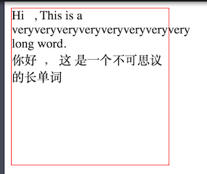
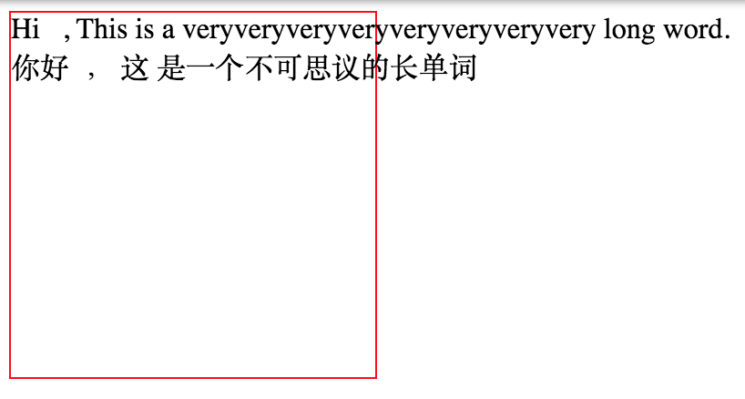
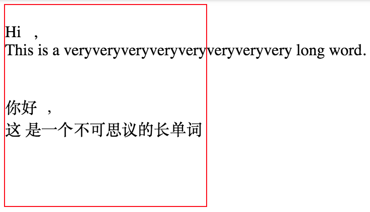
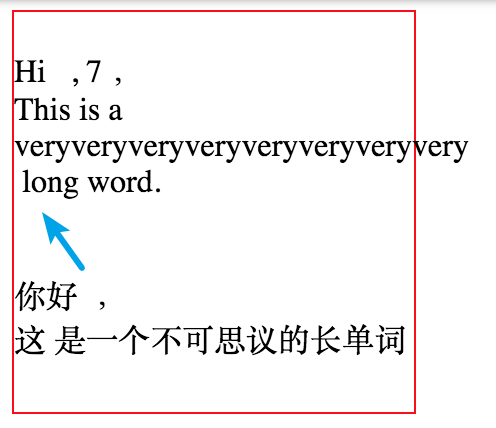
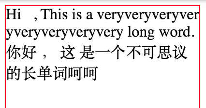

过一遍，记忆&理解

```、、
// html
<div id="box">
  Hi&nbsp;&nbsp;&nbsp;,
  This   is a veryveryveryveryveryveryveryvery long word.
  </br>
  你好&nbsp;&nbsp;，
  这   是一个不可思议的长单词
</div>

// css
#box {
  width: 200px;
  height: 200px;
  border: 1px solid red;
}
```
效果：  


* 连续的空格会被缩减成一个（比如This和is之间的三个空格变成了一个）
* &nbsp: 不会被缩减
  - A non-breaking space means that the line should not be wrapped at that point, just like it wouldn’t be wrapped in the middle of a word.
  - non-breaking spaces are not collapsed, regular space ' ' will.
* html换行符无效
* 自动换行
* 长度超过一行的单个单词会超出边界

## white-space
* value: normal | pre | nowrap | pre-wrap | pre-line | inherit
* 设置如何处理元素中的空白， 默认normal

1. nowrap: 不换行   

* 自动换行没了

2. pre: preserve, 保留    


* html中的换行被保留
* 自动换行没了
* 连续空格还是被缩减为1个

3. pre-wrap; // preserve + wrap, 保留html中换行 + 自动换行    
   pre-line; // preserve + wrap + new line, 保留html中换行 + 自动换行 + new line
* 差别： pre-wrap vs pre-line   
 ---


## word-break： normal
指定了怎样在单词内断行    
参考： https://developer.mozilla.org/zh-CN/docs/Web/CSS/word-break

## overflow-wrap(word-wrap)
* value: normal | breaak-word
* 控制单词如何被拆分：只有当一个单词一整行都显示不下时，才会拆分换行该单词

word-break: break-word;  VS overflow-wrap: break-word;  
  --- 

* normal: 剩余空间不够显示完整单词就将该单词显示在下一行， 若整行都不够单词也不拆分，就溢出
* word-break: break-word: 剩余空间不够显示完整单词就将该单词拆分
* overflow-wrap: break-word: 剩余空间不够显示完整单词就把该单词显示在下一行，若整行都不够单词就拆分

## 总结
* white-space，控制空白字符的显示，同时还能控制是否自动换行。它有五个值：normal | nowrap | pre | pre-wrap | pre-line
* word-break，控制单词如何被拆分换行。它有三个值：normal | break-all | keep-all
* word-wrap（overflow-wrap）控制长度超过一行的单词是否被拆分换行，是word-break的补充，它有两个值：normal | break-word


## 参考
* [彻底搞懂word-break、word-wrap、white-space](https://juejin.im/post/5b8905456fb9a01a105966b4)
* [white-space](https://developer.mozilla.org/zh-CN/docs/Web/CSS/white-space)
